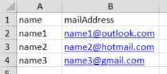
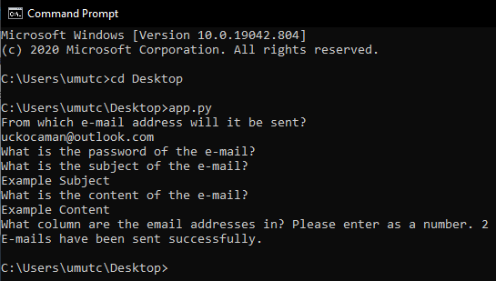

# BulkMailSender

An application that sends the same email with one click to e-mail addresses read from Excel.

For now, it only works on the console. In later versions, it will also be used as a desktop application and website.

It can only be sent from Gmail, Outlook and hotmail e-mail addresses. To send e-mails, you must also enter the password of your e-mail address. However, it will not appear when entering your password. You must enter the subject and content of the mail separately. In later versions, the content of the e-mail can be sent from the text file.

The Excel file must be in the same directory as the app.py file. Finally, you need to enter the number in which column the e-mail addresses are in the excel file.

## As an example, excel can be as follows.

## The program works as in the picture below.

